# 🧠 Causal Critic — Causal Value Function Estimation for Actor–Critic Architectures

This repository accompanies the paper
**“Causal Value Function Estimation for Actor–Critic Architectures”**
(*submitted to AAMAS 2026*).

---

## 📖 Overview

We introduce a **Causal Critic** for Reinforcement Learning, implemented through **Vectorized Bayesian Networks (VBNs)** — a differentiable, GPU-accelerated representation of **Structural Causal Models (SCMs)**.
The Causal Critic explicitly models the **causal effect of actions on rewards**, removing spurious correlations and improving **sample efficiency**, **training stability**, and **policy convergence**.

Our implementation extends **Vanilla Actor–Critic** and **Advantage Actor–Critic (A2C)** with a *drop-in causal replacement* of the critic.

---

## ✨ Highlights

* 🔍 **Causal Value Estimation** — learns
  ( Q_{\mathrm{do}}(s,a) = \mathbb{E}[R \mid \mathrm{do}(A=a), S=s] )
* ⚙️ **Vectorized Bayesian Networks (VBNs)** — continuous causal reasoning with GPU acceleration
* 🧩 **Modular Integration** — plug-and-play with any Actor–Critic variant
* 📈 **Performance Gains** — up to **+32 %** on Vanilla AC and **+15 %** on A2C across Gymnasium benchmarks
* 🎥 **Smooth & Stable Learning Curves** — lower variance and policy-independent critics

---

## ⚡ Quick Start

```bash
# 🧱 Build Python environment
python3 -m venv .venv
source .venv/bin/activate        # (Linux/macOS)
# .venv\Scripts\activate         # (Windows)

pip install --upgrade pip
pip install -r requirements.txt

# 🚀 Run main experiments
python3 main.py
```

---

## 🎬 Visual Results

| Environment        | Rollout                            |
| ------------------ |------------------------------------|
| **Acrobot-v1**     | 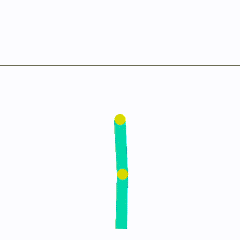      |
| **CartPole-v1**    | 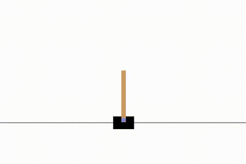    |
| **LunarLander-v3** | 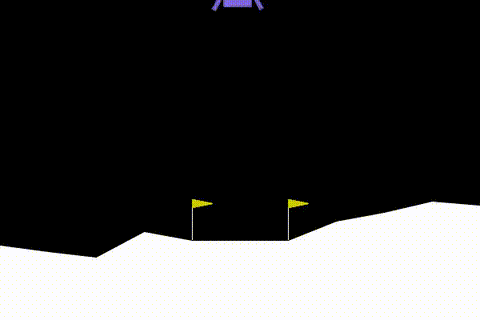 |
| **Pendulum-v1**    | 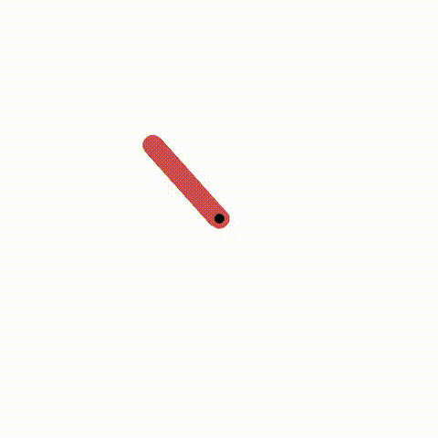     |

> Each GIF visualizes the policy’s evolution across training — the Causal Critic variants typically show smoother and faster convergence.

---

## 📊 Evaluation Plots

| Environment          | Evaluation Return                                         |
| -------------------- |-----------------------------------------------------------|
| **BipedalWalker-v3** | 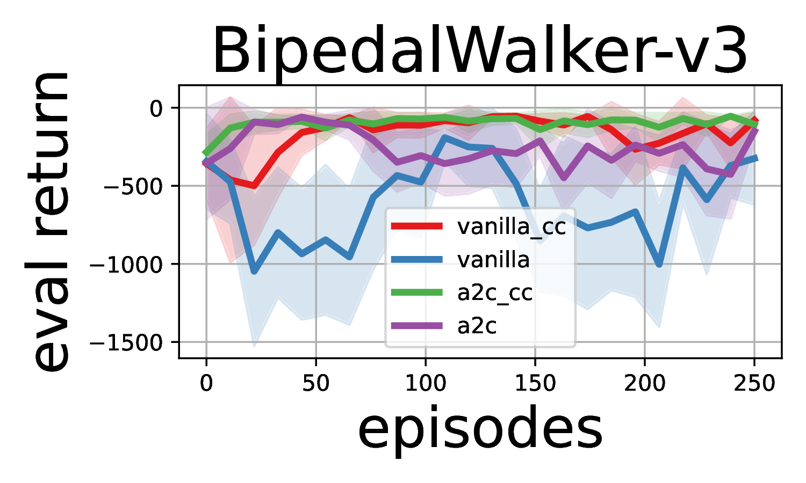 |
| **FrozenLake-v1**    | 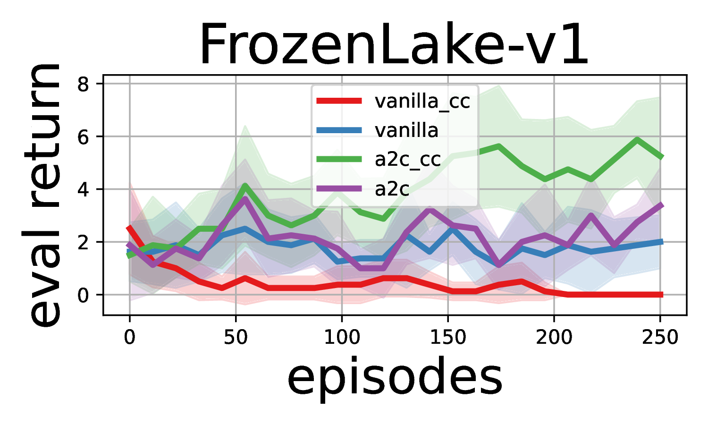    |
| **LunarLander-v3**   | 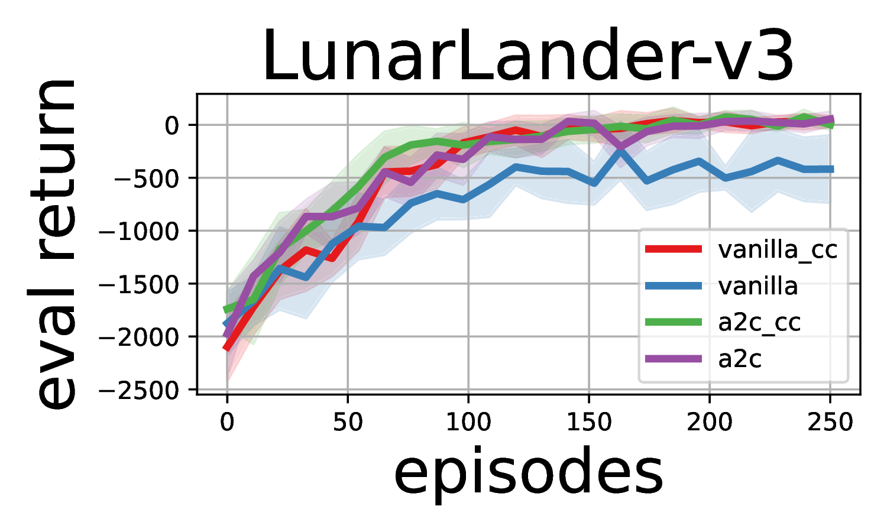   |
| **Walker2d-v5**      | 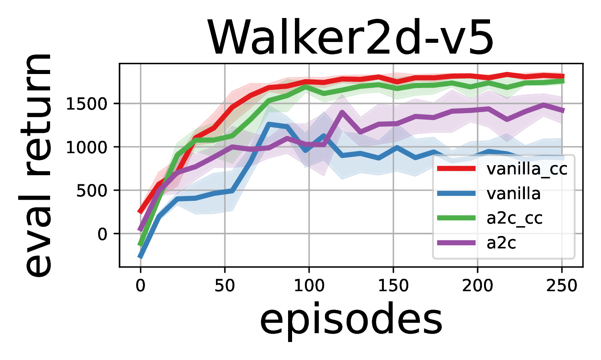      |

---

## ⚙️ Computational Complexity

| Inference-Only                                    | Training + Inference                          |
| ------------------------------------------------- | --------------------------------------------- |
| 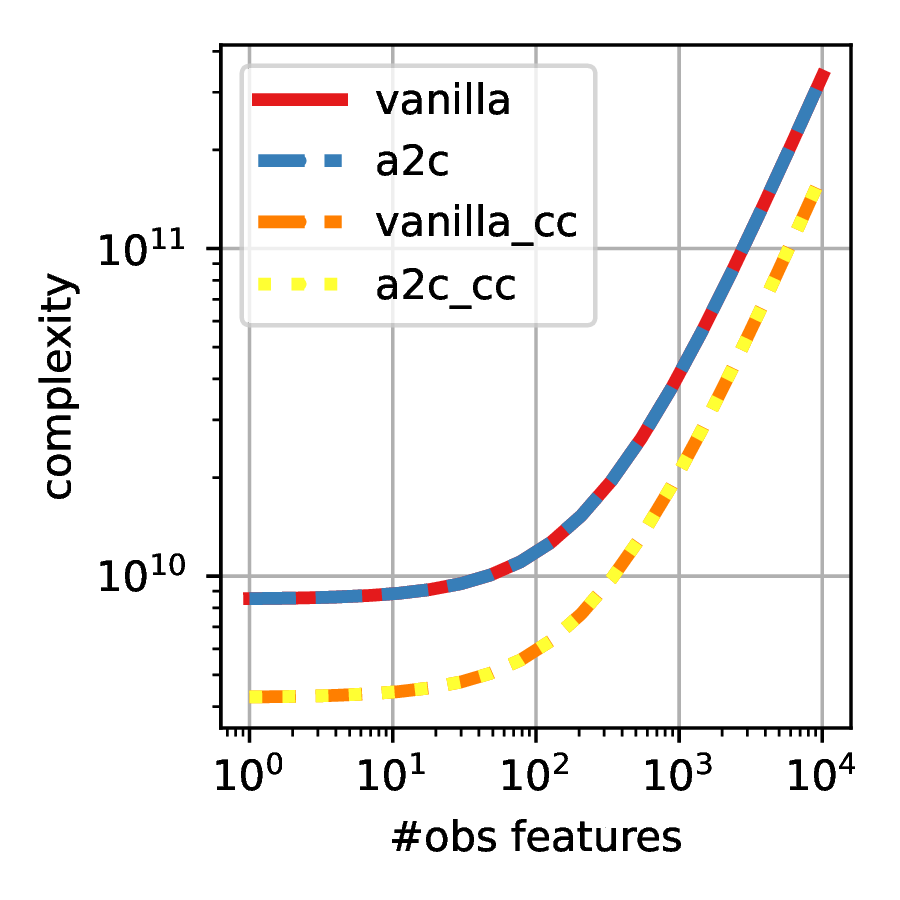 | 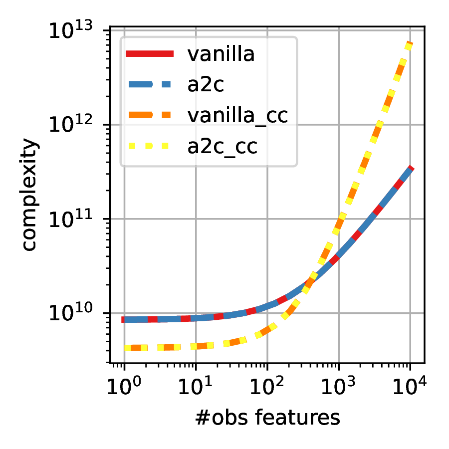 |

> The Causal Critic exhibits comparable scaling to standard neural critics, remaining efficient for moderate-size observation spaces.

---

## 🔬 Run Ablation Study

```bash
# 🧱 Build Python environment
python3 -m venv .venv
source .venv/bin/activate
pip install -r requirements.txt

# 🎯 Run ablation experiments
python3 run_ablation.py
```

---

## 📈 Kullback–Leibler Ablation Results

| Easy Environments                                 | Medium Environments                               | Hard Environments                               |
| ------------------------------------------------- | ------------------------------------------------- | ----------------------------------------------- |
| 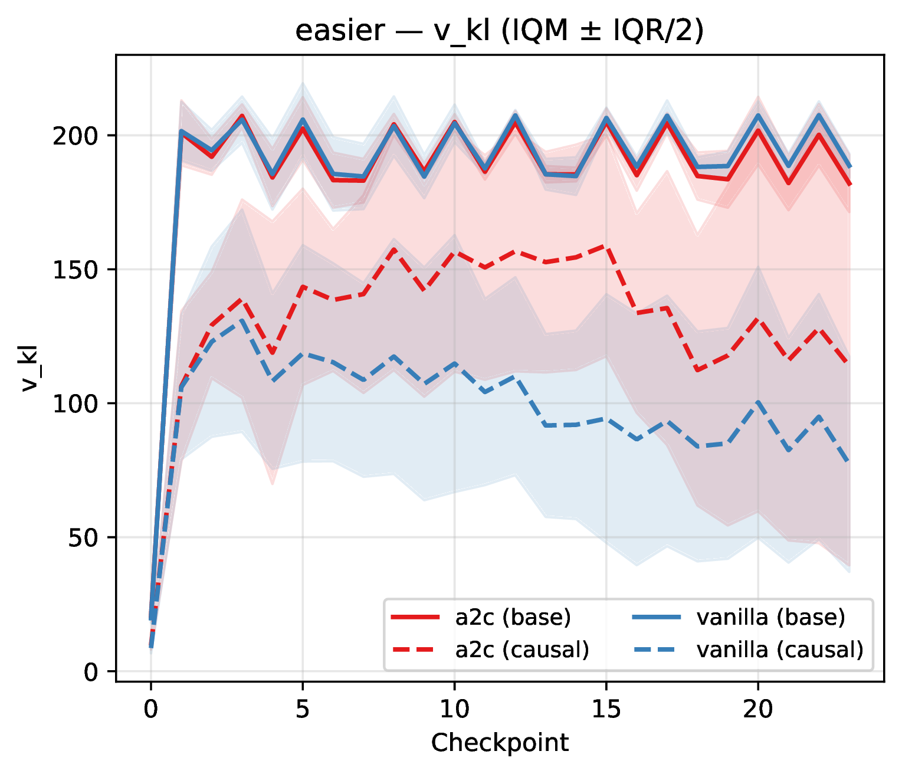 | 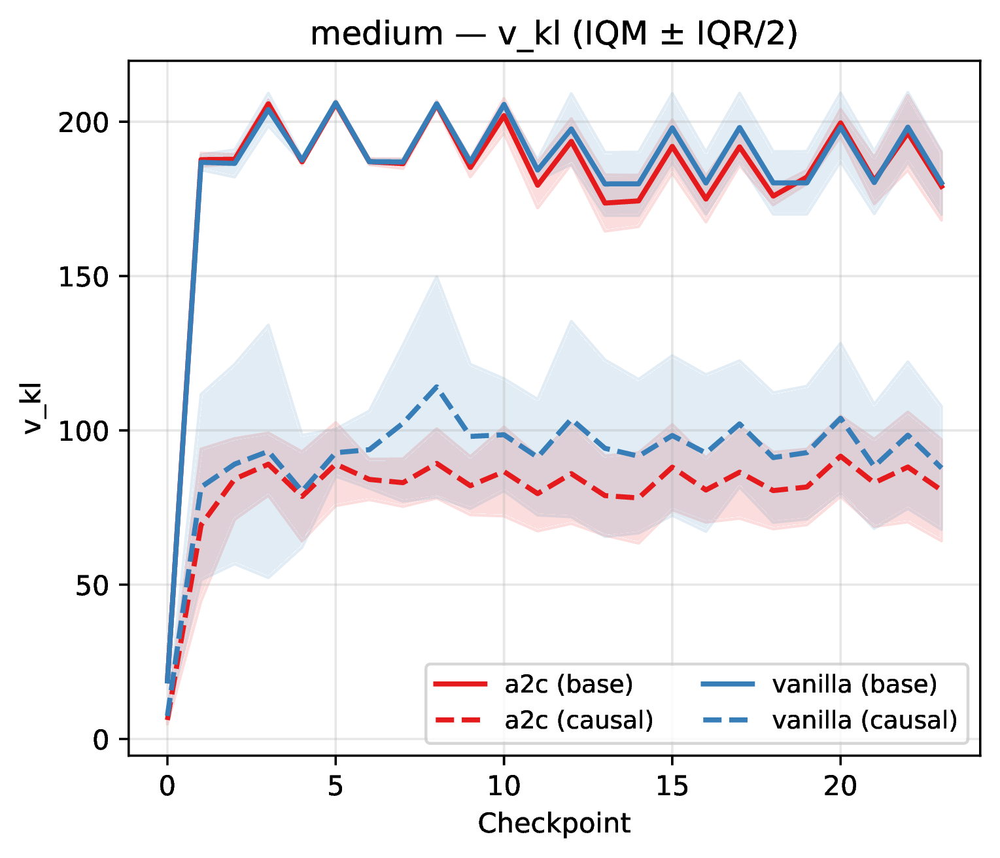 | 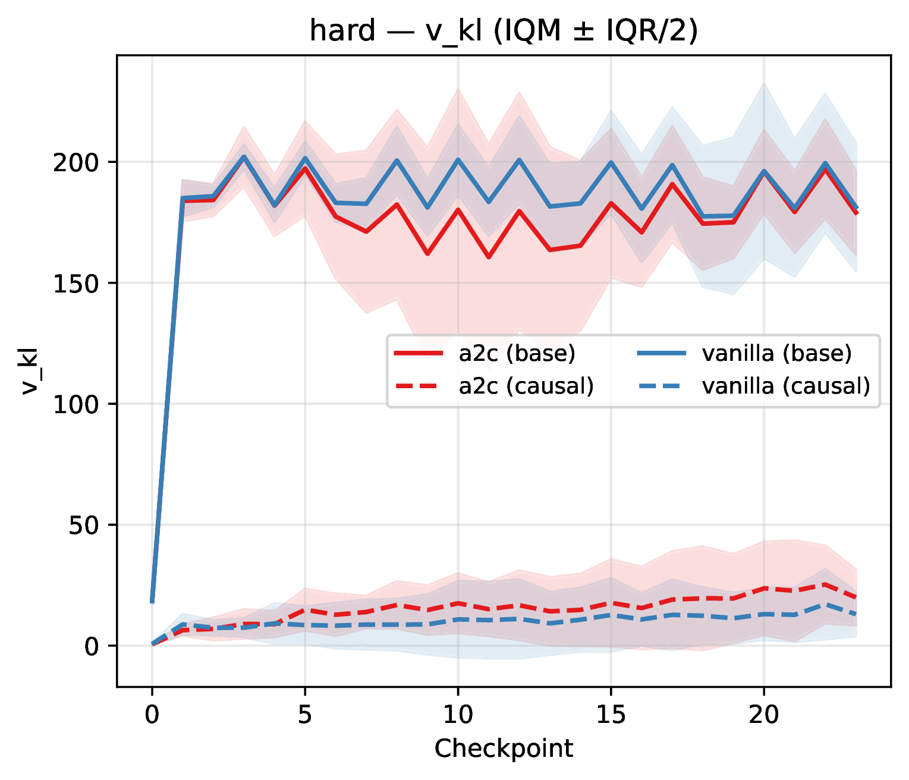 |

> Lower KL divergence and smoother trends confirm that the Causal Critic produces more stable, policy-invariant value estimates.
